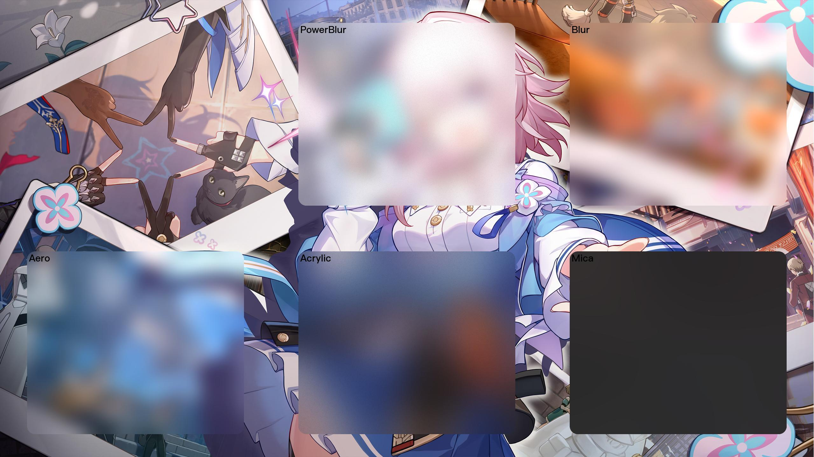

<h1 align="center">PowerBlur</h1>

## 📖介绍

PowerBlur是一个基于Pillow的图像模糊处理工具，自由度极高，能够实现类似win/Mac等系统的毛玻璃效果（？）

## ⬇️安装

#### 请务必使用0.0.3及以上版本，否则可能无法正常使用
#### 若无法下载提示未找到包，请使用官方源
```bash
pip install PowerBlur
```

## 🧑‍💻食用方法

### 示例代码
```python
from PIL import Image
import PowerBlur

# 加载图像
image = Image.open("image.jpg")

# 获取图片尺寸
width, height = image.size

# 创建模糊处理对象
blur = PowerBlur.PowerBlur(image, (int(width*0.1), int(height*0.1), int(width*0.9), int(height*0.9)))

# 模糊处理
blurred_image = blur.draw()

# 保存模糊处理后的图像
blurred_image.save("output.jpg")
```

### 参数说明

| 参数         | 是否必要/默认值          | 类型         | 说明                            |
|------------|-------------------|------------|-------------------------------|
| image      | ✔️                | Image      | 需要处理的图像                       |
| size       | ✔️                | tuple/list | 需要处理的图像区域，格式为(x1, y1, x2, y2) |
| radius     | ❌（默认值25）          | int        | 圆角尺寸，0即无圆角                    |
| mask_fill  | ❌（默认值255,255,255） | tuple/list | 蒙版颜色(R,G,B)                   |
| mask_alpha | ❌（默认值100）         | int        | 蒙版透明度（0~255），0即完全不透明，100即完全透明 |
| noise_mean | ❌（默认值0.03）        | float      | 高斯噪声均值(0~255)                 |
| noise_std  | ❌（默认值10）          | float      | 高斯噪声标准差，为0时无噪声                |
| sigma      | ❌（默认值5）           | float      | 高斯模糊参数，0即无模糊                  |
| exposure   | ❌（默认值1）           | float      | 曝光度（0~10），0即无                 |
| saturation | ❌（默认值1）           | float      | 饱和度，0即无                       |

### 担心这么多参数设置起来麻烦，我们为你准备了一些预设

| 预设名称      | 中文名称 | 配方                         |
|-----------|------|----------------------------|
| PowerBlur |      | 默认的，没啥好说的吧……反正作者我觉得挺好看的    |
| Blur      |      | 基础的模糊效果，没什么特别的             |
| Aero      |      | Windows 7 的玻璃效果，具有曝光和饱和度效果 |
| Acrylic   | 亚克力  | 模糊, 叠加混合, 饱和度, 颜色蒙版, 噪点纹理  |
| Mica      | 云母   | 模糊, 饱和度, 颜色蒙版              |


## ✨效果展示

### 原始图片

### 处理后图片

